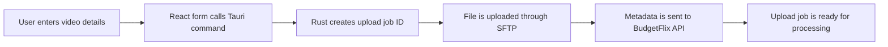

<div align="center">

# Media Uploader

Desktop-first media upload tool for the BudgetFlix media workflow.

Built with a fast React interface, a native Tauri shell, and backend-side upload handling for SFTP-based media ingestion.

<br />


<br />


</div>

---

## Overview

**Media Uploader** is a native desktop application designed to move media files into the BudgetFlix upload pipeline.

The current version focuses on a simple, direct upload flow: choose a local video path, provide a title and type, authenticate with the deployment password, upload the file through SFTP, then register the upload job through the backend API.

The project is still in early development, but it is structured as the foundation for a larger media operations tool with dashboards, queues, automation, monitoring, and processing features.

---

## What It Does Today

- Runs as a native desktop app through **Tauri 2**
- Provides a React-based upload form
- Accepts local media file paths
- Uploads videos to a remote SFTP inbox
- Creates unique upload job IDs
- Sends upload metadata to the BudgetFlix API
- Uses a Rust command layer for desktop/backend integration
- Includes Tailwind CSS and DaisyUI for UI styling

---

## Tech Stack

| Layer | Tools |
| --- | --- |
| Desktop shell | Tauri |
| Frontend | React, TypeScript, Vite |
| Styling | Tailwind CSS, DaisyUI |
| Native/backend layer | Rust |
| Upload transport | SFTP / SSH |
| API communication | Reqwest |
| Future services | Go |

---

## Project Structure

```txt
media-uploader/
+-- src/
|   +-- App.tsx
|   +-- main.tsx
|   +-- pages/
|   |   +-- MovieForm.tsx
|   +-- layout/
|   +-- components/
+-- src-tauri/
|   +-- src/
|   |   +-- lib.rs
|   |   +-- main.rs
|   |   +-- sftp.rs
|   +-- Cargo.toml
|   +-- tauri.conf.json
+-- public/
+-- package.json
+-- README.md
```

---

## Getting Started

### Requirements

- Node.js
- npm
- Rust toolchain
- Tauri prerequisites for your operating system

### Install Dependencies

```bash
npm install
```

### Run Frontend Development Server

```bash
npm run dev
```

### Run Desktop App

```bash
npm run tauri dev
```

### Build Frontend

```bash
npm run build
```

### Build Desktop App

```bash
npm run tauri build
```

---

## Available Scripts

| Command | Description |
| --- | --- |
| `npm run dev` | Starts the Vite development server |
| `npm run build` | Type-checks and builds the frontend |
| `npm run preview` | Serves the production frontend build locally |
| `npm run tauri` | Runs Tauri CLI commands |

---

## Upload Flow



---

## Roadmap

- Drag-and-drop media selection
- Upload progress tracking
- Better validation and error feedback
- Queue view for multiple upload jobs
- Dashboard for upload activity
- Media metadata editing
- Server health monitoring
- FFmpeg-based processing hooks
- Thumbnail generation
- Multi-server configuration
- Settings screen for remote endpoints and credentials

---

## Development Status

| Field | Value |
| --- | --- |
| Version | `0.1.0` |
| Stage | Early development |
| Main focus | Upload pipeline foundation |
| Platform | Desktop |

---

## Notes

This project is part of the BudgetFlix tooling ecosystem. It is currently intended for internal development and controlled upload workflows.
